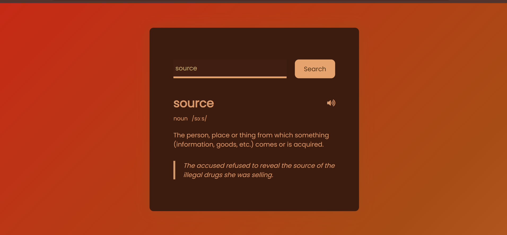
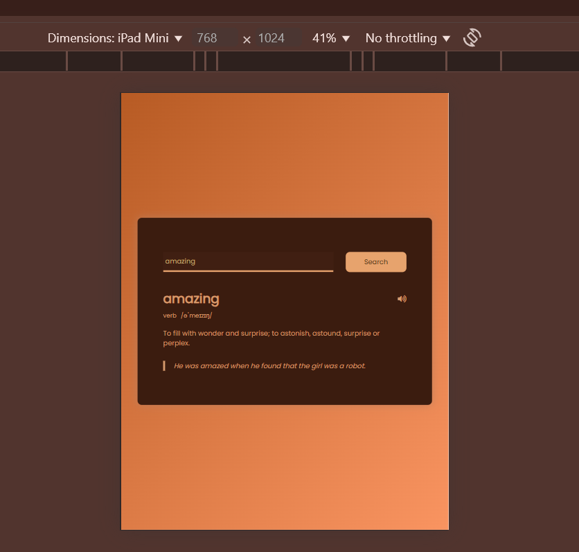

# 📚 Dictionary Web App

This is my **first JavaScript-based project**, a simple yet functional **dictionary web app** built using HTML, CSS, and JavaScript. The app fetches definitions, phonetics, and example sentences for any English word using the [Free Dictionary API](https://dictionaryapi.dev/). ✨

## 🚀 Features

- 🔍 Search any English word
- 📖 Displays part of speech, phonetics, and meanings
- 🔊 Pronunciation audio (if available)
- 💡 Clean, responsive UI with animated background
- 💅 Custom color theme with glowing hover effects

---

## 🧑‍💻 Tech Stack

- **HTML5**
- **CSS3** (with gradient animation & styling)
- **Vanilla JavaScript**
- **Free Dictionary API**

---

## 📸 Screenshots

### 🔎 Word Lookup Interface

### 📱 Responsive Design Preview

---

## 📂 Project Structure

📁 dictionary-app/
├── 📄 index.html
├── 📄 style.css
├── 📄 script.js
├── 📁 screenshots/
│ ├── screenshot1.png
│ └── screenshot2.png

---

## 🧠 What I Learned

- How to fetch data from an API using JavaScript
- Handling asynchronous code with `async/await`
- DOM manipulation and event handling
- Styling a responsive layout with transitions & animations
- Creating a smooth UI using pure CSS and minimal libraries

---

## 📌 Future Improvements

- Add search history
- Dark mode toggle
- Mobile-first redesign
- Support for synonyms & antonyms

---

## 🙌 Acknowledgements

- [Free Dictionary API](https://dictionaryapi.dev/)
- [Poppins font](https://fonts.google.com/specimen/Poppins)

---

### 💖 Thanks for checking it out!
