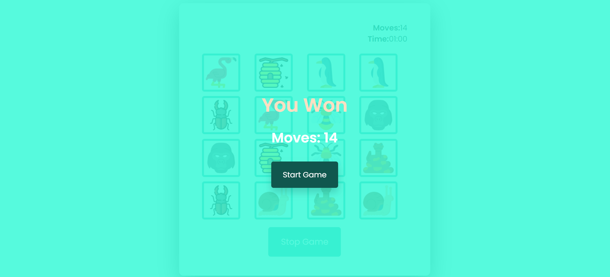

# 🧠 Memory Matching Game

A simple yet engaging **Memory Card Matching Game** built using **HTML, CSS, and JavaScript**. Flip the cards, find all the matching pairs, and challenge yourself to complete the game in the fewest number of moves and shortest time!

## 🚀 Features

- Interactive card-flip animations
- Randomized layout every game
- Move counter and timer
- Win detection with a popup
- Clean and modern UI

## 🌿 Card Design

This game uses cute and colorful animal icons from the **Rainforest Icon Pack** by [flaticon.com](https://www.flaticon.com/). The images were used for the card faces to make the game visually engaging and thematic.

## 🖥️ Preview

### 🕹️ Gameplay in Action

### ✅ Winning Screen

### 🔁 Initial State

## 🛠️ Tech Stack

- **HTML**
- **CSS** (Flexbox, shadows, transitions)
- **JavaScript** (DOM manipulation, timers, event handling)

## 📁 Folder Structure

memory-game/
│
├── index.html
├── style.css
├── script.js
├── Screenshot-1.png
├── Screenshot-2.png
└── Screenshot-3.png
