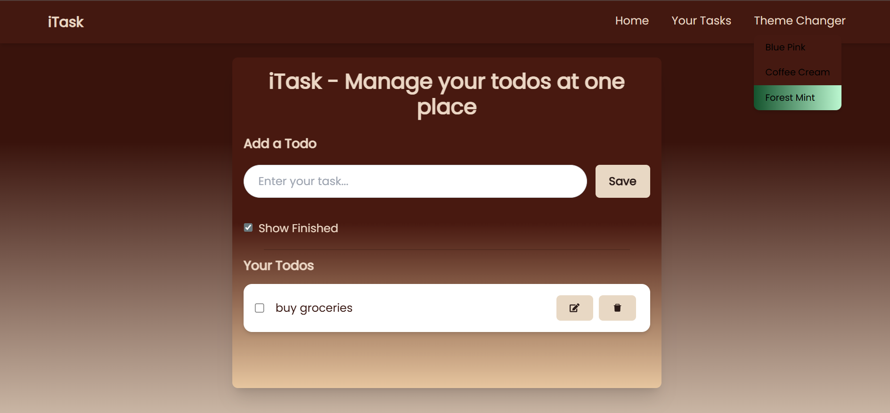
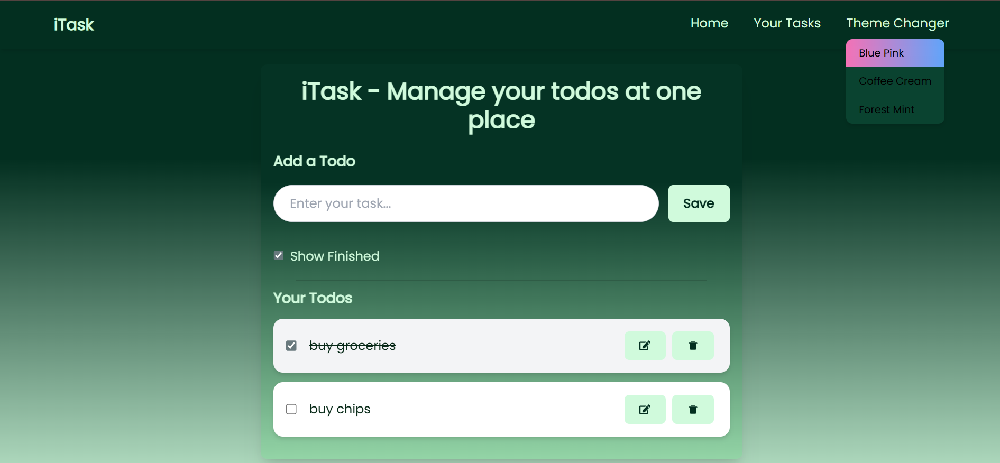

# iTask - Todo App with Theme Switching 🌈

A simple and interactive Todo App with multiple theme options.  
Built using **React + Vite**, styled with **TailwindCSS**, and tasks are saved in **localStorage**.

---

## 🚀 Features
- Add, delete, and manage tasks
- Theme switching (Blue-Pink, Coffee-Cream, Forest-Mint)
- Responsive design with TailwindCSS
- Tasks persist using localStorage

--- 

## 🛠 Tech Stack
- **React.js** - Frontend UI
- **TailwindCSS** - Styling
- **localStorage** - Persistence
- **Vite** - Build tool

---

## 📂 Project Structure
Todo-app/
├── public/
├── src/
│ ├── components/ # Navbar, Todo, etc.
│ ├── App.jsx
│ ├── App.css
│ ├── index.css
│ └── main.jsx
├── package.json
├── tailwind.config.js
└── vite.config.js

---
## 📸 Screenshots
|  |
|  |
|  |

---

## 🔗 Demo
[▶ Watch Demo on Google Drive](https://drive.google.com/file/d/1Ie1VM0n7X0jQOru_TA_P_yZLKr4jB_LC/view?usp=sharing)
