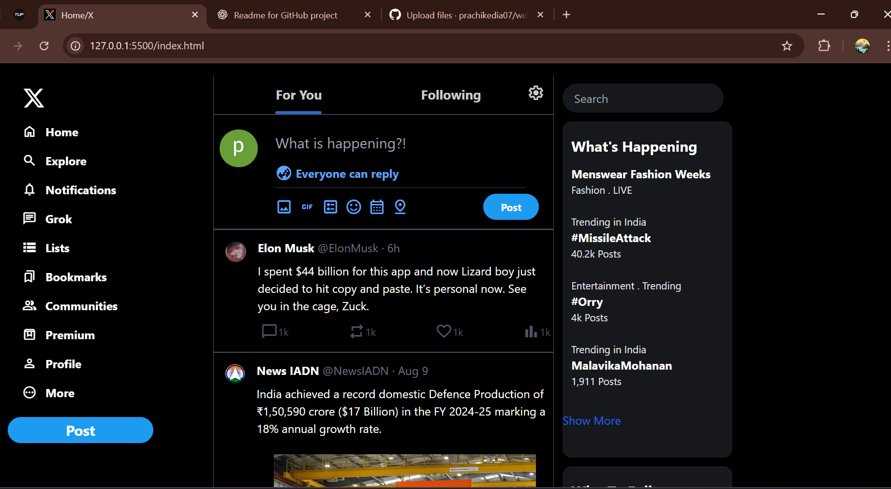
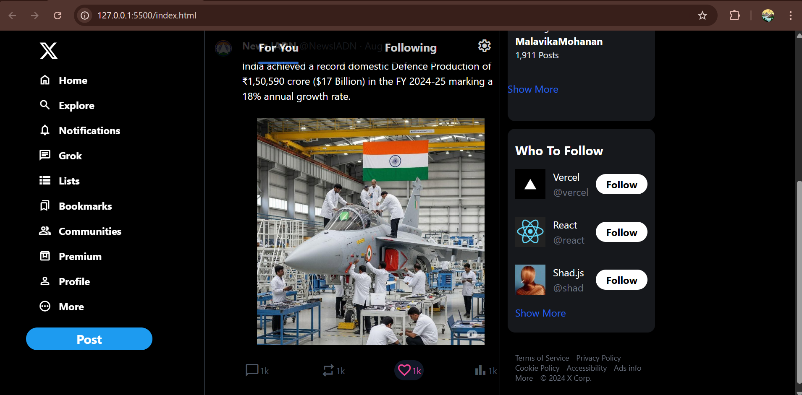

# 🐦 Twitter Front Page Clone

A simple **Twitter (X) front page** clone built using **Tailwind CSS**.  
This project was created for learning and practicing **frontend web development** and UI styling.

---

## 📸 Screenshots

| Screenshot 1 | Screenshot 2 |
|--------------|--------------|
|  
|  

---

## 🎥 Demo

Video preview:  

[🎬 Watch Demo](demo/demo.mp4)

---

## 🛠️ Tech Stack

- **HTML5**
- **Tailwind CSS**

---

## 📂 Folder Structure

Twitter(X)-clone/
│
├── css/
│   ├── input.css
│   ├── output.css
│
├── node_modules/
│
├── index.html
├── package-lock.json
├── package.json
├── tailwind.config.js

---

## 🚀 How to Run Locally

1. **Clone the Repository**
   ```bash
   git clone https://github.com/your-username/your-repo-name.git
   cd your-repo-name
2. **Install Dependencies**
   npm install
3. **Build Tailwind CSS**
   npx tailwindcss -i ./css/input.css -o ./css/output.css --watch
4. **Open in Browser**
   Just open index.html in your browser.

   ---

## 📜 Credits
This UI is inspired by Twitter/X for educational purposes only.
Posts, tweets, and media used in the screenshots are publicly available content and belong to their respective creators:
Tweet by Elon Musk (@ElonMusk)
Post by News IADN (@NewsIADN)
⚠️ Note: This project is not affiliated with, endorsed by, or connected to Twitter/X.
All rights for brand assets and original content belong to their respective owners.

---

## 📌 Purpose
  Practice Tailwind CSS
  Learn UI layout techniques
  Understand modern responsive design


